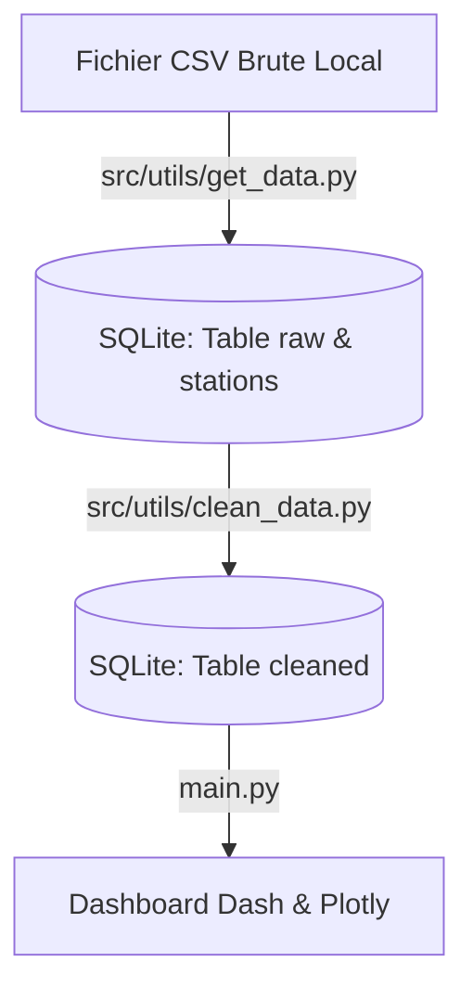

# Dashboard de Pollution Atmosphérique

## User Guide
Pour utiliser et tester le projet Python :
- Cloner le dépôt : `https://github.com/gautkn1ght/MiniPython_AirQuality.git`.
- Installer les dépendances avec `uv sync`.
- Lancer l'application avec `python main.py`.
- Ouvrir le navigateur avec l'adresse URL sur le terminal.

## Data 
Les données brutes récupérer et utiliser pour les jeux données :
- Mesures horaires de polluants : issues de data.gouv.fr (Jeu de données temps réel). (https://www.data.gouv.fr/datasets/donnees-temps-reel-de-mesure-des-concentrations-de-polluants-atmospheriques-reglementes-1)
  
- Référentiel géographique : Geod'air (LCSQA / Ineris) pour associer chaque code site à sa Latitude/Longitude. (https://www.geodair.fr/donnees/referentiel-mesure)

## Developer Guide

## Copyright
Je déclare sur l'honneur que le code fourni a été produit par moi-même